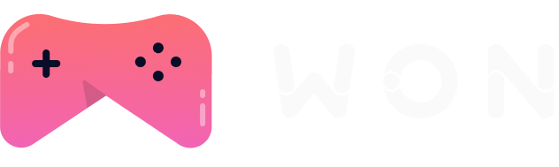

  

## Sobre o projeto
A Won é um ecommerce de games que foi criado durante o curso <a href="https://reactavancado.com.br/" target="_blank">React Avançado</a>.
 
Durante o projeto foram criados:
- Páginas SSG & SSR com [NextJS](https://nextjs.org/)
- Autenticação com [NextAuth](https://next-auth.js.org/)
- Criação de componentes com [Storybook](https://storybook.js.org/)
- Testes com [React Testing Library](https://testing-library.com/docs/react-testing-library/intro) & [Jest](https://jestjs.io/)
- Teste de requisições com [Mock Service Worker](https://mswjs.io/)

## Outras tecnologias incríveis utilizadas:
- [TypeScript](https://www.typescriptlang.org/)
- [Styled Components](https://styled-components.com/)
- [Eslint](https://eslint.org/)
- [Prettier](https://prettier.io/)
- [Husky](https://github.com/typicode/husky)

## Layout
O layout do projeto pode ser visuzalizado <a href="https://www.figma.com/file/cJxFLkHXqEhXDV7VH7GHtw/Won-Games?node-id=263%3A2285" target="_blank">clicando aqui</a> 
